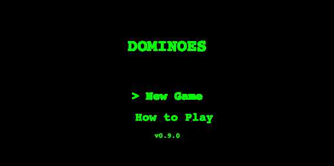
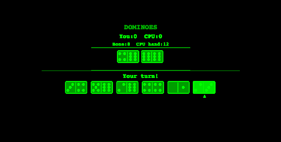
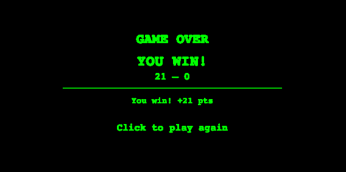

# Dominoes

Classic double-six dominoes for **Even Realities G2** smart glasses: play against the CPU with scroll/tap/double-tap controls on a micro-LED display.

## Screenshots

| Menu | Gameplay | Game Over |
|:----:|:--------:|:---------:|
|  |  |  |

## Quick links

- **In-app help:** Open the app URL on your phone to see the full instructions (getting started, controls, rules, tips). Same content as [index.html](index.html) in this repo.

## Tech stack

- **Runtime:** TypeScript, Vite
- **Game engine:** Internal double-six domino engine in `src/engine/` (deck generation, board logic, CPU AI, scoring)
- **Glasses:** [Even Hub SDK](https://www.npmjs.com/package/@evenrealities/even_hub_sdk) — containers, image/text updates, event mapping
- **Rendering:** Canvas-based board rendering + composed image tiles for G2 layouts (3-tile + 1-text container)

## Project structure

```text
EvenDominoes/
├── index.html          # Entry page; shows help/docs on phone, mounts app for G2
├── src/
│   ├── main.ts         # Bootstrap, event handling, game loop
│   ├── engine/         # Pure game engine: deck, board, CPU AI, scoring
│   │   ├── types.ts    # DominoPiece, GameState, BoardState interfaces
│   │   ├── deck.ts     # Deck generation (double-six), shuffle, deal
│   │   ├── board.ts    # Chain logic, placement validation, orientation
│   │   ├── cpu.ts      # CPU opponent AI
│   │   └── game.ts     # Round management, turn flow, scoring
│   ├── display/        # G2 rendering pipeline
│   │   ├── renderer.ts # Renderer class: menu, game, rules, game-over screens
│   │   ├── canvas-utils.ts # Canvas → PNG tile slicing (200×100 per tile)
│   │   └── pieces.ts   # Domino piece drawing (dots, borders)
│   └── audio/          # Audio feedback (experimental)
│       └── beep.ts     # AudioContext-based beep tones
└── assets/             # Screenshots for README and store listing
```

## Prerequisites

- **Even Realities** — G2 glasses and the [Even App](https://www.evenrealities.com/) (so you can open the widget and see the game on your glasses).
- **Node.js** — v20 or newer. [Download Node.js](https://nodejs.org/) if needed.

## Setup

1. **Clone and install**
   ```bash
   git clone https://github.com/<owner>/EvenDominoes.git
   cd EvenDominoes
   npm install
   ```

2. **Run locally**
   ```bash
   npm run dev
   ```
   You'll see a local URL (e.g. `http://localhost:5173`). Keep this terminal open while you use the app.

3. **Open in the Even App**
   - **Option A:** Run `npx evenhub qr` in the project folder, then scan the QR code with the Even App.
   - **Option B:** Open the dev URL (e.g. `http://<your-computer-ip>:5173`) in the Even App's in-app browser.

4. **Try it**
   - On your **phone:** Open the same URL in a browser to see the [help/docs page](index.html).
   - On your **glasses:** Scroll to select pieces, tap to play, double-tap to draw.

## Usage on the glasses

- **Scroll** — Move selection cursor between pieces in your hand, or navigate menu items.
- **Tap** — Play the selected domino, confirm a menu choice, or start a new game after game over.
- **Double-tap** — Draw a piece from the boneyard. On game over, returns to menu. On choose-end prompt, places on the right end.

## Scripts

| Command | Description |
|---------|-------------|
| `npm run dev` | Start dev server |
| `npm run build` | Build for production |
| `npm run pack` | Build + package into `.ehpk` for Even Hub |

## Build and deploy

```bash
npm run pack
```

Output is `domino.ehpk`. Upload this file to the [Even Hub Developer Portal](https://hub.evenrealities.com/) for review and distribution.

## Game rules (Double-Six)

- **28 pieces** in a standard double-six set (values 0–6 on each half)
- Each player gets **7 pieces**; remaining 14 form the **boneyard**
- Match one end of your piece to an open end of the board chain
- If you can't play, **draw** from the boneyard
- First player to **empty their hand** wins the round
- If blocked (no moves, empty boneyard), lowest pip count wins
- Winner scores the total pips remaining in the opponent's hand

## Features

- **Classic double-six gameplay** against a CPU opponent
- **3-tile G2 rendering** — optimised for the 200×100 pixel hardware limit per image container
- **In-game rules** — "How to Play" screen accessible from the main menu
- **Choose-end prompt** — when a piece fits both ends of the chain, pick left or right
- **Score tracking** — accumulated across rounds
- **Companion help page** — full documentation served as the app's web page

## License

MIT License. See [LICENSE](LICENSE).
